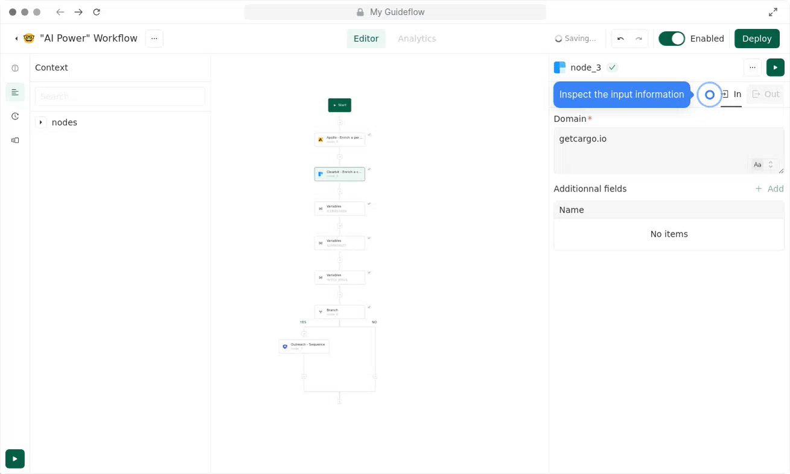

# 🧢 Expressions 101

## **Crafting Expressions:**

* Expressions in Cargo are a bit like **formulas in Excel**, where you combine data and functions.
* To invoke the power of JavaScript, **wrap your input with \{{ \}}**. Anything outside is treated as plain text. \<add visual>
* **Autocompletion:** It's like a predictive text. If you've run a node before, typing '.' will suggest possible entries. \<add gif>
* **Node output:** Every node in a Cargo workflow gives feedback when successfully run. The  "In" shows the input, "Out" displays the outcome. If a node didn't generate any output, "Out" might be blank.

***

## Syntax

In every workflow in Cargo, expressions allow you to access the available data, you should use a liquid-like syntax starting with '\{{' and closing with '\}}'.&#x20;

```javascript
{{nodes.NAMEOFTHENODE.attributes}}
```

Whether you want to use AI prompt to explain an action or to configure an action, you will always use these principles.&#x20;

For instance, if you want to see which data you have at your disposal when starting the workflow, you can write <mark style="color:green;">\{{nodes.start.</mark> too see the available data at this point.&#x20;

<figure><figcaption></figcaption></figure>

if you would like to get the information enriched by the "Apollo" nodes in the example below you would do <mark style="color:green;">\{{nodes.node\_3\[...]\}}</mark> and select the attributes you want like below\
_Hint: You can rename the nodes to whatever you please_

<figure><figcaption></figcaption></figure>

## Handling elements inside an array

The standard syntax above evolves slightly when you're referencing data that exists inside an array of objects, as the one below:

<figure><figcaption></figcaption></figure>

In this example you can see the data object are element of an array, whose first item is `0`. Within this object there’s a sub object called `properties`, which then contains the name of a company, , i.e. `name`, that we're interested in.

When dealing with such an array syntax evolves a bit, where you first have to reference the index number of the item in the array before being able to access the objects inside, as in the example below:\


<figure><figcaption></figcaption></figure>

Let's break it down:

1. for the array item you need a `[0]` so it knows which one you’re talking about. The next item would be indexed as `[1]`
2. next, you need to reference `.properties` to reference the data inside
3. then, you can see item `.name` inside

## Autocompletion

When you want to preview which data you have available to use in an expression entering dot ( . ) character within the curly brackets ( \{{ \}} ) will trigger a preview of available nodes, as in the GIF below.

In the example below, we're able to select the email option after having entered the '.' character after start, i.e. <mark style="color:green;">\{{nodes.start.</mark>

<figure><figcaption></figcaption></figure>

_Hint: only runs that have already executed before your node will be available in the preview, as otherwise the preview has no means of knowing whether they exist_


## Node output

Whenever a node executes you can inspect the information that went into and and was outputted from the node using the 'IN' and 'OUT' buttons on the top right of the Edit modal on the right of the screen.

<figure><figcaption></figcaption></figure>


## Fallback logic

A very powerful Cargo feature is the ability to set fallback values.

This can be used for occasions when you know that data being returned will be inconsistent in some way. It is used as a fallback logic to deal with inconsistent data. It takes the first attribute, and if empty, take the second one.

To use multiple attributes in a field, you can use the double pipe “||”.&#x20;

<figure><figcaption><p><em>Fallback logic</em></p></figcaption></figure>


**The fallback logic is often used within a waterfall enrichment step**: when pushing an enriched data to your CRM, you want to make sure something is pushed. For instance, you have two different sources of email data, you put both to maximize coverage rate.


## You can execute any JavaScript operator within an expression.

[More here](https://docs.getcargo.io/expressions/expressions-101/javascript-snippets)

<figure><figcaption><p>Example of Javascript expression</p></figcaption></figure>


