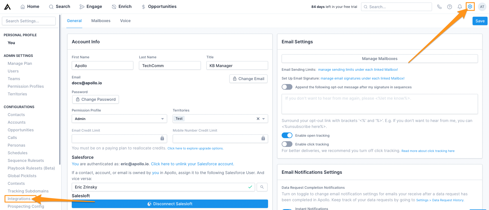
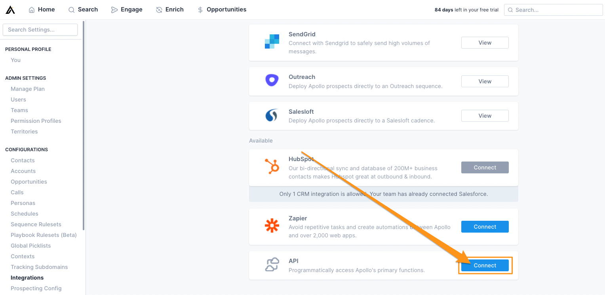
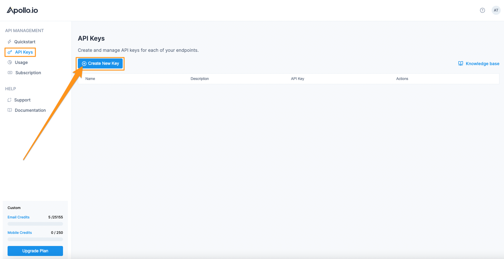

# 🔭 Apollo.io

Connect Apollo.io to further enrich your contact and account data.

### How to authenticate?

Launch Apollo and click **Settings**. Then, click **Integrations** under the "Configurations" section.

<figure><figcaption></figcaption></figure>

Scroll to **API** and click **Connect**.

<figure><figcaption></figcaption></figure>

Click **API Keys** to view or create new **API Keys**. Then, click **+ Create New Key** to generate a new API Key.

<figure><figcaption></figcaption></figure>

Name your new **API Key** and add a description.

\

### Available actions

**Read** - Retrieve information about an organization/person

**Search** - Retrieve organization records
