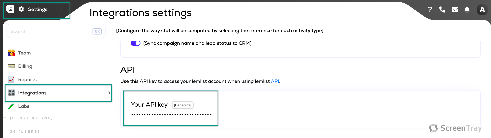

# 📤 Lemlist

Connect your Lemlist to personalize and automate your email campaigns

### How to authenticate?

Log In to your Lemlist Account. Click the Settings tab in the left-side navigation and then click on Integrations. Copy your API key and paste it in the “API Key” field on Cargo

<figure><figcaption>
Lemlist integrations settings
</figcaption></figure>

### Available actions

**Write** - insert/delete a contact to a campaign

**Unsubscribe a contact** - unsubscribe a contact from a campaign

