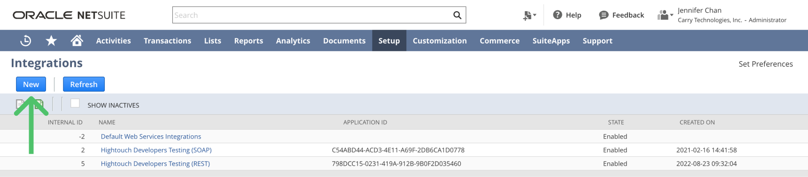

# 🍧 Mixpanel

Connect your Mixpanel and load your event to a dataset

### How to authenticate?

_<mark style="color:red;">You must have Owner or Admin permissions on mixpanel to generate credentials for this integration.</mark>_

You can view and create service accounts in your organization in the Service Accounts tab in your [Organization settings](https://mixpanel.com/settings/org#serviceaccounts)

<figure><figcaption></figcaption></figure>

You can also manage service accounts in your [project settings](https://mixpanel.com/settings/project#serviceaccounts).

<figure><figcaption></figcaption></figure>

You will be asked to select the role and granted projects of the when creating a service account from the organization's settings page.

<figure><figcaption></figcaption></figure>

Once the service account is created copy Username and secret in your connector's config on cargo.

<figure><figcaption></figcaption></figure>
