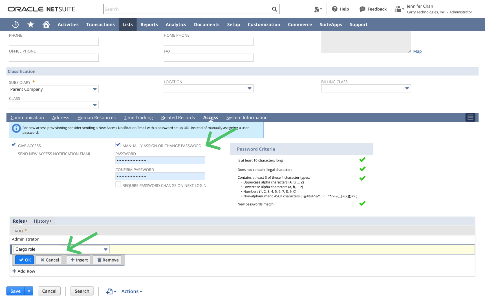

# 🪅 Netsuite

**Supported operations:** Search Action, loaders

**Supported entities:** All

Setting up Cargo to sync data with NetSuite involves creating and configuring a NetSuite integration, creating a role, a user, and an authentication token for the integration. Here are the detailed steps:

#### Create an integration

* Go to **Setup > Integration > Manage Integrations**.

<figure><figcaption></figcaption></figure>

* Click **New** to create a new integration with the following properties:
  * **Name**: "Cargo Integration"
  * **State**: Enabled
  * Check **Token-Based Authentication**
  * Uncheck **TBA:Authorization flow** and **Authorization Code Grant**

<figure><figcaption></figcaption></figure>

* Scroll down to **Client credentials** and copy the **Consumer Key / Client ID** and **Consumer Secret / Client secret**. Save them securely.

<figure><figcaption></figcaption></figure>

* Click **Save**.

#### Create a role

* Go to **Setup > Users/Roles > Manage Roles**.
* Click **New** to create a new role with the following properties:
  * **Name**: "Cargo Role"
  * Check **Do not restrict employee fields**
  * For multi-subsidiary NetSuite users, check **All** under **Accessible subsidiaries**
  * Under **Authentication**, check **Web Services only Role**

<figure><figcaption></figcaption></figure>

* Under **Permissions > Setup**, grant the following permissions:
  * Access Token Management: Full
  * Custom Body Fields: Full
  * Custom Column Fields: Full
  * Custom Entity Fields: Full
  * Custom Fields: Full
  * Custom Item Fields: Full
  * REST Web Services: Full
  * User Access Tokens: Full
* Under **Permissions > Lists and Permissions > Transactions**, provide Full permissions for the NetSuite entities you plan on syncing to.
* Under **Permissions > Lists and Permissions > Lists**, provide Full permissions for the NetSuite items you plan on syncing to.
* Under **Permissions > Lists and Permissions > Reports**, provide Full permission for **SuiteAnalytics Workbook**

<figure><figcaption></figcaption></figure>

* Click **Save**.

#### Create a user

* Go to **Setup > Users/Roles > Manage Users**.
* Create a new user or select an existing user.
* Fill in the required fields in the Employee form.
* On the **Access** tab, check **Manually assign or change password** and assign a secure password.
* Under **Roles**, assign the "Cargo Role" you previously created.
* Click **Save**.

<figure><figcaption></figcaption></figure>

#### Create an access token

* Go to **Setup > Users/Roles > Access Tokens**.
* Click **New Access Token**.

<figure><figcaption></figcaption></figure>

* Select the integration, user, and role you previously configured.

<figure><figcaption></figcaption></figure>

* Click **Save**.
* Copy and store the **Token ID** and **Token Secret** securely.

<figure><figcaption></figcaption></figure>

#### Enable REST web services

* Go to **Setup > Company > Enable Features > SuiteTalk (Web Services)**.
* Enable **REST Web Services**.
*   Under **Manage Authentication**, enable:

    * **Token Based Authentication**:&#x20;

<figure><figcaption></figcaption></figure>

After completing these steps, you'll have set up the necessary configurations in Caro Netsuite Connector.

<figure><figcaption></figcaption></figure>

### Available actions

**Search** - Retrieve Netsuite object records

