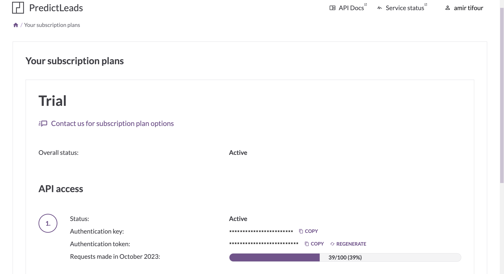

# 🔭 PredictLeads

Connect your PredictLeads account to enrich companies and search for it's linked (Events, Products, Github repositories…)

### How to authenticate?

Log In to your PredictLeads account. On top left Click on your profile => Your subscription plans. Generate a **API Key** and **API Token** paste it in Cargo's connector configuration field.

<figure><figcaption></figcaption></figure>

### Available actions

**Read** - Enriches your data with companies data.

**Search** - Retrieve data about companies's : Products, Github Repositories, connections, job openings, website evolution, technologies, Events.

