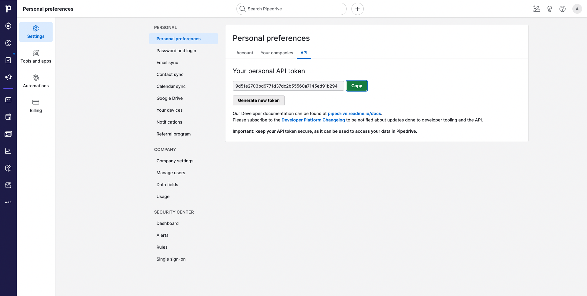

# Pipedrive

Sync lead and prospect data from Cargo to Pipedrive.

**Supported operations:** upsert, delete, and update.

**Supported entities:** Organization, Person, Deal, and Lead.

###

### How to authenticate?

* Click on your profile icon (top right corner)
* Choose personal preferences
* Select the API tab
* Copy the API token and paste it into Cargo

<figure><figcaption>
Pipedrive API token
</figcaption></figure>

### Available actions

**Object** - Perform operations on the supported Pipedrive entities&#x20;
